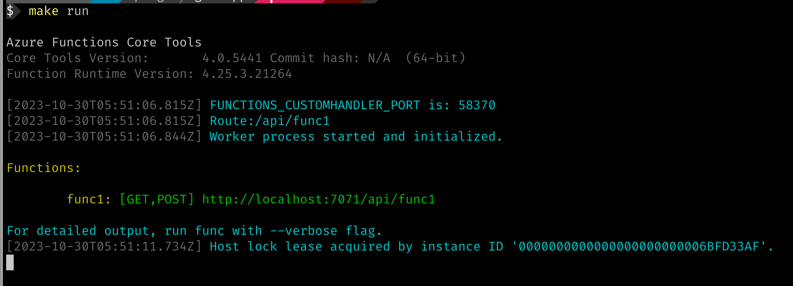

# Overview

This repo is an example of how we might create an [Microsoft Azure Function](https://azure.microsoft.com/en-au/products/functions) using [Go language](https://go.dev/). Go lang doesn't have an existing template whilst using [Azure Functions Core Tools](https://learn.microsoft.com/en-us/azure/azure-functions/functions-run-local?tabs=macos%2Cisolated-process%2Cnode-v4%2Cpython-v2%2Chttp-trigger%2Ccontainer-apps&pivots=programming-language-csharp#install-the-azure-functions-core-tools). As such we need to use a "custom handler" to run Go lang applications either locally or in the cloud.


## Prerequisites

- Install the [Azure Functions Core Tools](https://learn.microsoft.com/en-us/azure/azure-functions/functions-run-local?tabs=macos%2Cisolated-process%2Cnode-v4%2Cpython-v2%2Chttp-trigger%2Ccontainer-apps&pivots=programming-language-csharp#install-the-azure-functions-core-tools).
- Install Go
- Clone this repo

## Running the sample App

- Go to the root of this repo
- Check make options:
    

- Run `make run` to start the app:

    

- Click on `http://localhost:7071/api/func1` to browse the app

## App details

The application is enclosed in the [func1](./func1/) folder in [hello.go](https://github.com/katasec/gofnapp/blob/main/func1/hello.go). It uses a standard `http.ServeMux` with a single registered route:

```go
	mux := http.NewServeMux()
	route := fmt.Sprintf("/api/%s", getDirName())
	mux.HandleFunc(route, helloHandler)
```

## host.json

The [host.json](https://github.com/katasec/gofnapp/blob/main/host.json) file in the root tells the Azure Function runtime the name and path of the binary to run:

```json
  "customHandler": {
    "enableForwardingHttpRequest": true,
    "description": {
      "defaultExecutablePath": "out/func1",
      "workingDirectory": "out",
      "arguments": [

      ]
    }
  }
```

## function.json

The [function.json](https://github.com/katasec/gofnapp/blob/main/func1/function.json) file in the `func1` directory tells the Azure function runtime to use an `httpTrigger` binding as the event to trigger any request/response for the `func1` functions app:

```json
{
  "bindings": [
    {
      "authLevel": "anonymous",
      "type": "httpTrigger",
      "direction": "in",
      "name": "req",
      "methods": [
        "get",
        "post"
      ]
    },
    {
      "type": "http",
      "direction": "out",
      "name": "res"
    }
  ]
}
```
